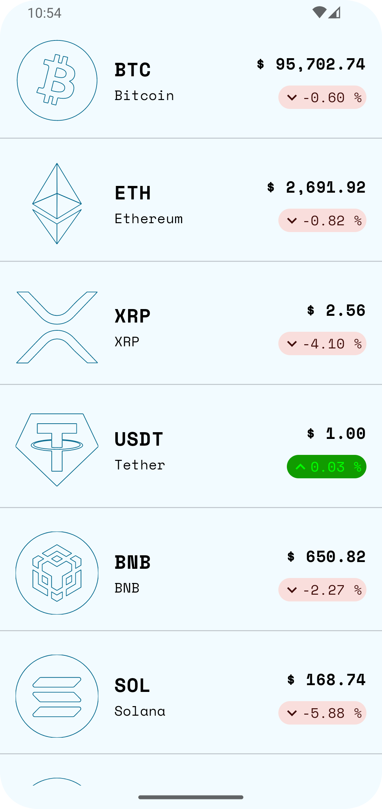

# Crypto Tracker App

✅ **Description**: 
Crypto Tracker App is a cryptocurrency price tracking application built with Kotlin, featuring a modern UI with Jetpack Compose.

## 📸 Screenshots

<p align="center">
  
  
</p>


## 🚀 Features

### 🖼️ User Interface
- Displays real-time cryptocurrency price lists
- Trend charts updated from API
- Modern Material 3 design with Light/Dark Mode

### 🏠 Architecture
- **Jetpack Compose** - Modern UI toolkit from Google
- **Koin** - Lightweight Dependency Injection
- **ViewModel** - Efficient state management
- 
### 🔗 API & Data
- **Ktor** - Fast API communication
- **Paging 3** - Efficient list data loading

## 🛠 Installation & Running the Project

1. Clone the repository:

```sh
git clone https://github.com/ngothiep2412/crypto-app.git
cd crypto-app
```

2. Open with **Android Studio** (Recommended version Dolphin or later)

3. Install dependencies:
```sh
gradlew build
```

4. Run the app on a device or Emulator:
```sh
gradlew installDebug
```
